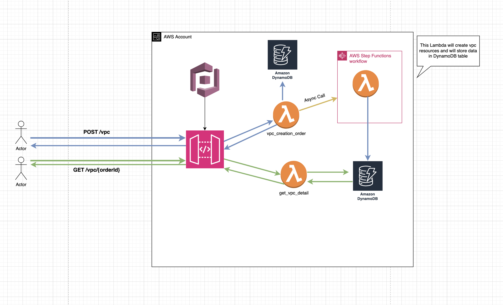

# VPC Resource Management API

## Overview

This repository provides an API for managing VPC resources. It exposes two endpoints:

1: POST /vpc - Creates a new VPC resource.
2: GET /vpc/{orderId} - Fetches details of an existing VPC resource.

The API follows an asynchronous architecture, using AWS services like API Gateway, Lambda, DynamoDB, and Step Functions.

## Architecture

The API is designed with the following AWS components:

* API Gateway: Handles HTTP requests and routes them to appropriate Lambda functions.

* Lambda Functions:

    * vpc_creation_order: Initiates VPC creation and stores order data in DynamoDB.

    * get_vpc_detail: Fetches VPC details from DynamoDB.

* DynamoDB: Stores VPC order and resource details.

* Step Functions: Manages the VPC creation workflow asynchronously.

## Directory structure

```bash
terraform/
├─ step_func_definitions/
├─ vpccreation/
├─ modules/
lambda/
├─ create_vpc/
├─ account-provisioning/
├─ vpc_creation_order/
```

## API Endpoints

**1: Create VPC Resource**

Endpoint: POST /vpc

* Description: Initiates the VPC creation process.
* Request Body (Example):
```bash
{
    "cidr_block": "10.0.0.0/18",
    "region_name": "eu-central-1",
    "vpc_name":"test"
}
```

* Response (Example):
```bash
{
  "orderId": "12345"
}
```


**2. Fetch VPC Details**

Endpoint: GET /vpc/{orderId}

* Description: Retrieves details of a VPC creation order.

* Response (Example):
```bash
{
  {
    "cidrBlock": "10.0.0.0/18",
    "vpcOrderCreationDate": "2025-02-23 17:11:31",
    "vpcName": "test",
    "orderId": "05613a0d-8796-4e55-a07a-789789ffcac3",
    "vpcId": "vpc-0a67615fb366330e2",
    "subnetDetail": [
        {
            "subnetId": "subnet-01d15d7dc5bb3e857",
            "subnetZone": "eu-central-1a",
            "subnetSize": "10.0.0.0/20",
            "subnetTier": "public"
        },
        {
            "subnetId": "subnet-09da0b7a5c67fdc09",
            "subnetZone": "eu-central-1b",
            "subnetSize": "10.0.16.0/20",
            "subnetTier": "public"
        },
        {
            "subnetId": "subnet-0e609d4550fc78a51",
            "subnetZone": "eu-central-1a",
            "subnetSize": "10.0.32.0/20",
            "subnetTier": "private"
        },
        {
            "subnetId": "subnet-0c6ca06558afa6295",
            "subnetZone": "eu-central-1b",
            "subnetSize": "10.0.48.0/20",
            "subnetTier": "private"
        }
    ],
    "regionName": "eu-central-1"
}
}
```

## Setup Instructions

1: Clone the repository:
```bash
    git clone <repository-url>
    cd <repository-folder>/lambda/create_vpc
    pip install -r requirements.txt -t ./
    cd ..
    cd vpc_creation_order
    pip install -r requirements.txt -t ./
    cd ../..
    cd terraform/vpccreation
    terraform init
    terraform apply -auto-approve
```    

2: Deploy AWS resources using Terraform or AWS CDK.

3: Deploy Lambda functions and configure API Gateway.

4: Test API using tools like Postman or curl.    

**Diagram**

Refer to the following diagram for a high-level architecture overview:

